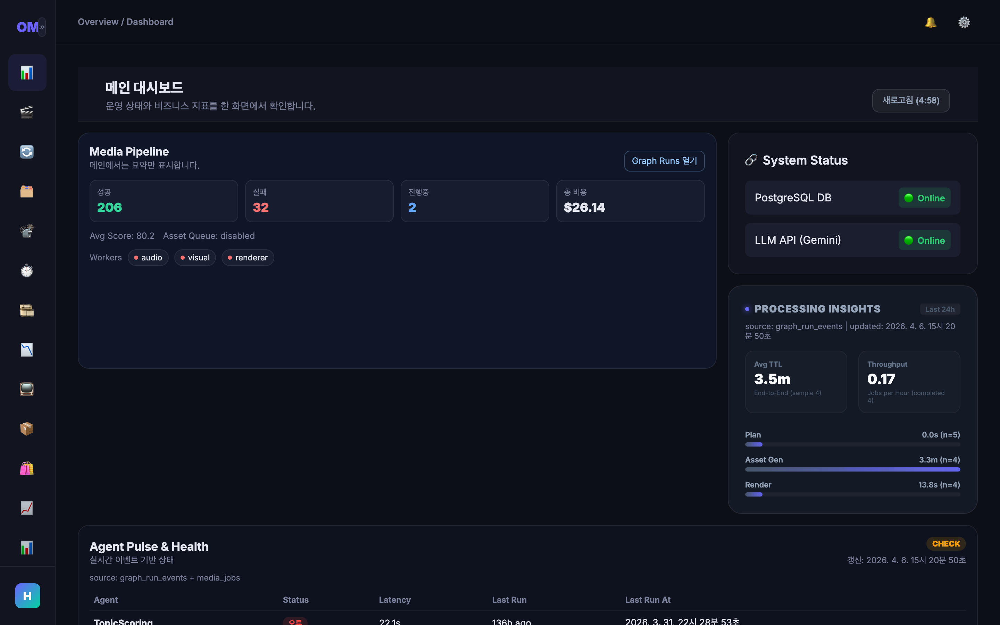
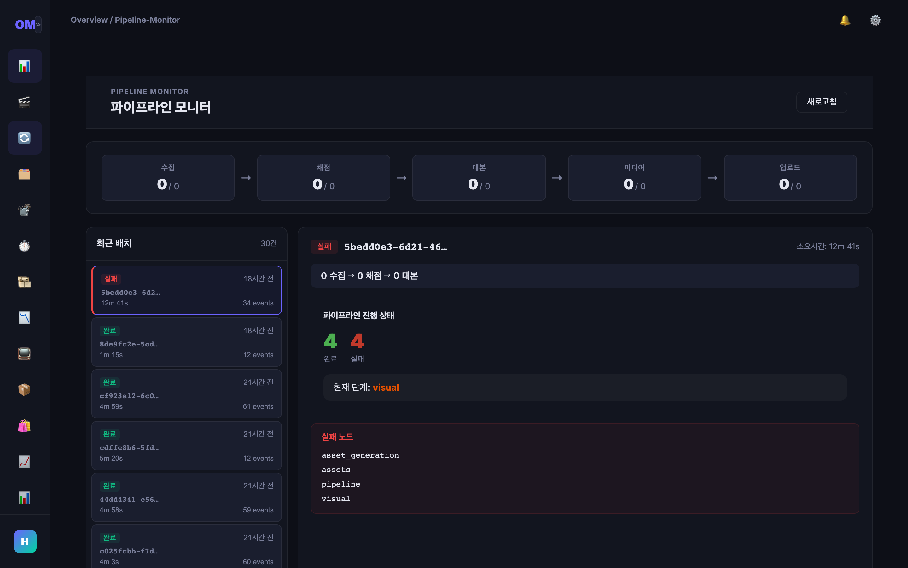
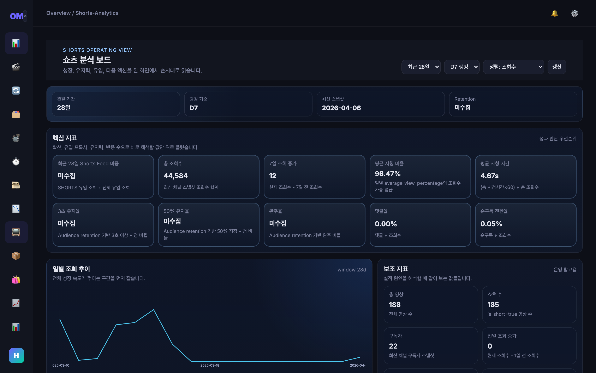
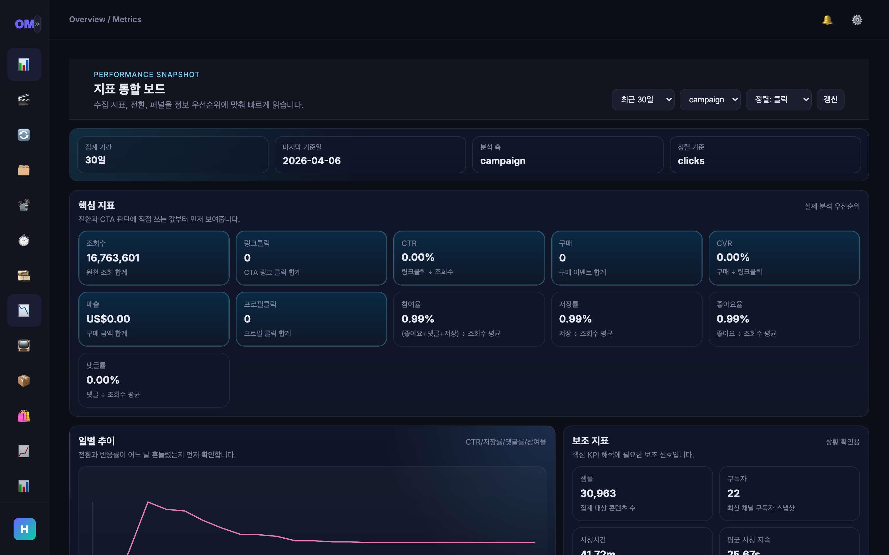
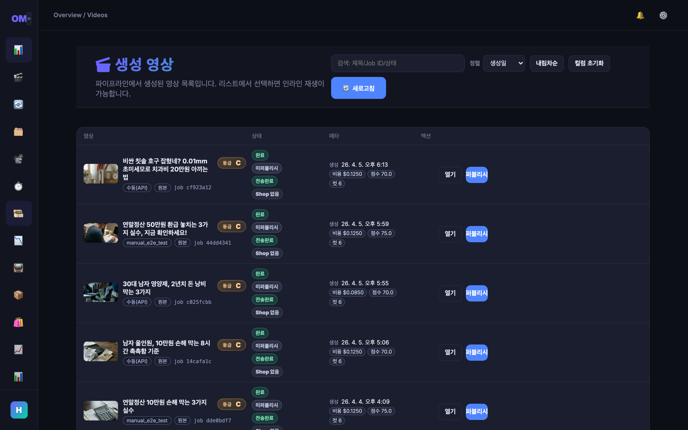
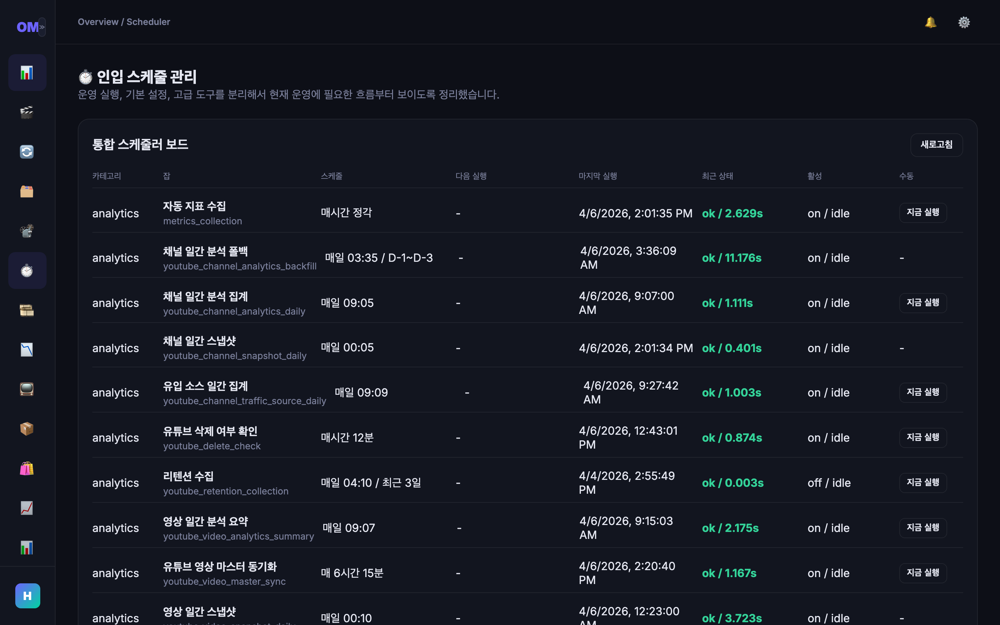
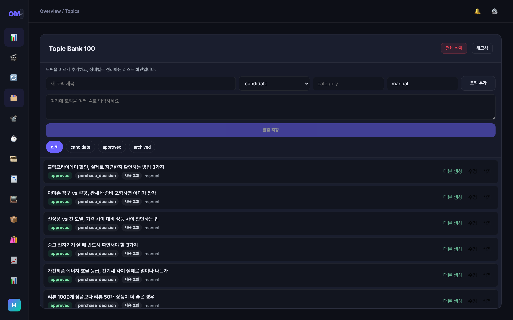

# OhMoney — LLM Agent-Based YouTube Shorts Automation System

> 금융/보험/투자 도메인 특화 YouTube Shorts 완전자동화 시스템.
> 수집 → 토픽 선정 → 스크립트 생성 → 미디어 렌더링 → 게시 → 분석 → 피드백 루프를 1인 운영으로 자동화합니다.

**Note:** 이 레포는 포트폴리오 공개용입니다. 프롬프트, 비즈니스 로직, 스코어링 알고리즘 등 핵심 지적 재산은 제외되어 있습니다.

---

## Screenshots

### Dashboard Overview

시스템 상태, 파이프라인 처리량, 에이전트 헬스체크를 한눈에 확인하는 메인 대시보드.



### Pipeline Monitor

파이프라인 실행 상태를 실시간으로 모니터링. 각 단계(수집→스코어링→스크립트→미디어→게시)의 진행 상황과 에러를 추적.



### Shorts Analytics

YouTube Shorts 핵심 지표(조회수, 시청 지속율, CTR) 분석 보드. 일별 추이와 보조 지표를 함께 제공.



### Metrics Board

수익 지표, 전환율, CPA 등 캠페인 성과를 종합적으로 분석하는 지표 통합 보드.



### Generated Videos

생성된 영상 목록. 각 영상의 상태, 생성일, 조회수를 확인하고 상세 정보에 접근.



### Scheduler

자동 수집, 분석, 게시 등 반복 작업의 스케줄 관리. 실행 이력과 상태를 실시간 확인.



### Idea Bank

토픽 아이디어 관리. 카테고리별 필터링, 상태 추적(candidate → approved → archived), 수동 토픽 추가.



---

## Architecture Overview

```
┌─────────────────────────────────────────────────────────────────┐
│                        Telegram Bot                             │
│                   (운영 명령 & 알림 수신)                          │
└──────────────────────────┬──────────────────────────────────────┘
                           │
┌──────────────────────────▼──────────────────────────────────────┐
│                     FastAPI Backend                              │
│  ┌──────────┐  ┌───────────┐  ┌───────────┐  ┌──────────────┐  │
│  │ REST API │  │ Scheduler │  │ Dashboard │  │  Monitoring  │  │
│  │ Routers  │  │ (APSched) │  │   Auth    │  │ (Prometheus) │  │
│  └────┬─────┘  └─────┬─────┘  └───────────┘  └──────────────┘  │
│       │              │                                           │
│  ┌────▼──────────────▼──────────────────────────────────────┐   │
│  │              LangGraph Orchestration                      │   │
│  │                  (master_graph)                            │   │
│  │                                                           │   │
│  │  Ingest → Candidate Selection → Topic Scoring             │   │
│  │    → Script Generation → Media Dispatch → Completion      │   │
│  └──┬────────────┬────────────┬────────────┬────────────┬───┘   │
│     │            │            │            │            │        │
│  ┌──▼──┐  ┌─────▼────┐  ┌───▼───┐  ┌────▼────┐  ┌───▼────┐   │
│  │Ingest│  │  Topic   │  │Script │  │ Visual  │  │  SEO   │   │
│  │Agent │  │ Scoring  │  │Agent  │  │ Agent   │  │ Agent  │   │
│  │      │  │  Agent   │  │(4stg) │  │         │  │        │   │
│  └──────┘  └──────────┘  └───────┘  └─────────┘  └────────┘   │
│     ... + 15 more specialized agents                            │
└──────────────────────────┬──────────────────────────────────────┘
                           │
┌──────────────────────────▼──────────────────────────────────────┐
│                   Media Pipeline (5 stages)                      │
│                                                                  │
│  Plan → Asset Generation → FFmpeg Render → Package → Publish     │
│         (Google Veo)       (1080×1920)    (YouTube)   (API v3)   │
│         (Gemini TTS)                                             │
│                                                                  │
│  Features:                                                       │
│  • 씬별 병렬 렌더링 (asyncio.Queue + worker pool)                  │
│  • 2-layer 캐싱 (L1: disk, L2: MinIO)                            │
│  • Dead Letter Queue로 실패 에셋 관리                               │
│  • 단계별 독립 재시도 & fallback                                    │
└──────────────────────────┬──────────────────────────────────────┘
                           │
┌──────────────────────────▼──────────────────────────────────────┐
│                     Vue 3 Dashboard                              │
│                                                                  │
│  • Pipeline Monitor (실시간 작업 상태)                              │
│  • Metrics Board (KPI 대시보드)                                    │
│  • Video Maker (수동 생성 인터페이스)                                │
│  • Scheduler (발행 스케줄 관리)                                     │
│  • Shorts Analytics (YouTube 성과 분석)                            │
│  • Idea Bank (토픽 아이디어 관리)                                    │
└─────────────────────────────────────────────────────────────────┘
```

---

## Tech Stack

| Layer | Technology |
|-------|-----------|
| **Backend** | Python 3.12 / FastAPI / SQLAlchemy 2.0 / ARQ (async task queue) |
| **Orchestration** | LangGraph (state machine-based pipeline) |
| **LLM** | Gemini (default) / GPT-4o-mini (high-quality) / Instructor (structured output) |
| **Media** | Google Veo (video gen) / Gemini TTS / FFmpeg |
| **Frontend** | Vue 3 + TypeScript + Vite + Pinia |
| **Infra** | Docker Compose / PostgreSQL / Redis / MinIO / Prometheus + Grafana |
| **Deploy** | Mac mini single-node |

---

## Key Design Decisions

### 1. LangGraph State Machine for Orchestration

일반적인 DAG 기반 워크플로우 대신 LangGraph의 `StateGraph`를 선택한 이유:

- **조건부 분기**: 토픽 등급(S/A/B/C)에 따라 LLM 프로바이더를 동적 라우팅
- **상태 추적**: `PipelineMasterState`로 전체 파이프라인 상태를 단일 TypedDict로 관리
- **취소 지원**: 각 노드 진입 시 취소 요청 확인 → 즉시 중단
- **재시도 격리**: 노드 단위 재시도로 전체 파이프라인 재실행 방지

```python
class PipelineMasterState(TypedDict, total=False):
    job_id: str
    candidates: list[CandidateItem]
    scored_topics: list[dict[str, Any]]
    scripts: list[ScriptPackageOutput]
    enqueued_media_jobs: list[str]
    # ... 15+ state fields
```

### 2. 4-Stage Script Agent Pipeline

단일 LLM 호출 대신 4단계 파이프라인으로 분리:

```
Writer → Director → Scene Planner → Finalizer
```

- **Writer**: 훅 + 본문 초안 생성
- **Director**: 품질 리뷰 & 개선 지시
- **Scene Planner**: 비주얼 씬 분해
- **Finalizer**: SEO/마케팅 데이터 포함 최종 패키지 조합

각 단계는 독립적으로 fallback 가능 → 부분 실패 시 전체 재생성 불필요.

### 3. Grade-Based LLM Cost Management

토픽 등급에 따라 LLM 프로바이더를 차등 배정:

| Grade | Provider | Rationale |
|-------|----------|-----------|
| S/A | GPT-4o-mini | 높은 기대수익 → 품질 투자 정당화 |
| B/C | Gemini Free Tier | 낮은 기대수익 → 비용 최소화 |

### 4. 2-Layer Media Cache

API 호출 비용과 속도를 최적화하기 위한 이중 캐시:

```
Request → L1 (Local Disk) → L2 (MinIO) → API Call
              ↑ write-back       ↑ write-through
```

- 동일 씬 재생성 시 API 호출 0회
- MinIO에 영구 보관 → 로컬 캐시 유실 시에도 복구 가능

### 5. Async-First with ARQ

모든 I/O를 비동기로 처리하되, 파이프라인 실행은 ARQ(Redis 기반 task queue)로 분리:

- API 서버는 작업 등록만 담당 → 즉시 응답
- 무거운 LLM/미디어 작업은 별도 워커에서 실행
- Single-flight lock으로 동일 작업 중복 실행 방지

---

## Agent Architecture

20개의 특화 에이전트가 각각 단일 책임을 가지며, `master_graph`를 통해 조율됩니다.

```python
# Base Agent Pattern
class BaseAgent(ABC, Generic[TIn, TOut]):
    """모든 에이전트의 추상 베이스 클래스"""

    @abstractmethod
    async def run_async(self, payload: TIn) -> TOut:
        ...

    async def run_via_langgraph_async(self, payload: TIn) -> TOut:
        """LangGraph StateGraph를 통한 실행 (추적/모니터링 통합)"""
        graph = self._get_invoke_graph()
        final_state = await graph.ainvoke({"payload": payload})
        return final_state["result"]
```

### Agent List

| Category | Agents |
|----------|--------|
| **Content Pipeline** | IngestAgent, TopicScoringAgent, ScriptAgent, VisualAgent, SeoAgent |
| **Media Pipeline** | PlanWorker, AssetWorker, RenderWorker, PackagerWorker, PublisherWorker |
| **Analytics** | MetricsCollectorAgent, EVEngineAgent, ExperimentJudgeAgent, WeeklyReportAgent |
| **Monetization** | ProductAgent, OfferRouterAgent, FunnelRouterAgent, LeadScoringAgent |
| **Operations** | ContentSyncAgent, LinkCheckAgent, FaqReplyAgent, NextTopicAgent |

---

## Media Pipeline

5단계 순차 처리 파이프라인. 각 단계는 독립적으로 재시도 가능합니다.

```
Plan → Asset → Render → Package → Publish
```

| Stage | Input | Output | Technology |
|-------|-------|--------|-----------|
| Plan | ScriptPackageOutput | Scene breakdown | LLM-based planning |
| Asset | Scene prompts | Video/Audio files | Google Veo + Gemini TTS |
| Render | Scenes + Audio | Final MP4 (1080×1920) | FFmpeg |
| Package | Video + Metadata | Upload-ready package | Title/Tags/Comments |
| Publish | Package | Published video | YouTube Data API v3 |

### Error Handling Strategy

| Stage | On Failure |
|-------|-----------|
| Plan | Abort pipeline, Telegram alert |
| Asset | 3 retries (exponential backoff) → static image fallback |
| Render | Skip failed scene, merge remaining |
| Package | Use default title/tags |
| Publish | Re-enqueue for next cycle |

---

## Data Flow

```python
# Core data contracts (Pydantic models)

class ScriptPackageOutput(BaseModel):
    """Script Agent → Media Pipeline 핸드오프 스키마"""
    idea_id: int
    hook: str
    body: list[str]
    cta: str
    template_type: str          # A/B/C/D
    visuals: list[VisualPrompt]
    video_scene_prompts: list[VideoScenePrompt]
    seo_data: SeoPackage
    marketing_data: MarketingData

class ScriptReadyPayload(BaseModel):
    """Media Pipeline 입력 스키마"""
    narration_text: str
    scenes: list[Scene]
    tone_profile: ToneProfile
```

---

## Infrastructure

```yaml
# Docker Compose Services
services:
  api_app:        # FastAPI backend (port 9100)
  scheduler:      # APScheduler daemon
  postgres:       # PostgreSQL database
  redis:          # ARQ queue backend
  minio:          # S3-compatible object storage
  prometheus:     # Metrics collection
  grafana:        # Metrics dashboard
```

```dockerfile
# Dockerfile highlights
FROM python:3.12-slim
RUN apt-get install -y ffmpeg fonts-noto-cjk fonts-nanum  # CJK font support
# Alembic migrations on startup
CMD ["uvicorn", "app.main:app", "--host", "0.0.0.0", "--port", "8000"]
```

---

## Project Structure

```
.
├── app/
│   ├── main.py                    # FastAPI application
│   ├── config.py                  # Environment-based settings
│   ├── db.py                      # SQLAlchemy session
│   ├── db_models.py               # ORM models (20+ tables)
│   ├── agents/
│   │   ├── base.py                # BaseAgent[TIn, TOut] ABC
│   │   ├── script_agent.py        # 4-stage script pipeline
│   │   ├── ingest_agent.py        # Topic ingestion
│   │   ├── topic_scoring_agent.py # Grade assignment (S/A/B/C)
│   │   ├── visual_agent.py        # Visual prompt generation
│   │   ├── seo_agent.py           # SEO optimization
│   │   └── ...                    # 15+ more agents
│   ├── orchestration/
│   │   ├── master_graph.py        # LangGraph state machine
│   │   ├── arq_tasks.py           # Background job orchestration
│   │   └── guards.py              # Auth & validation
│   ├── media_pipeline/
│   │   ├── pipeline.py            # 5-stage media orchestration
│   │   ├── models.py              # Pipeline data models
│   │   ├── workers/               # Plan/Asset/Render/Package/Publish
│   │   └── services/              # Cache, state, metrics, DLQ
│   ├── routers/                   # REST API endpoints
│   ├── schemas/                   # Pydantic I/O contracts
│   ├── services/                  # Business logic layer
│   └── collectors/                # Data source integrations
├── frontend/
│   ├── src/
│   │   ├── views/                 # 12 page components
│   │   ├── components/            # Reusable UI components
│   │   ├── composables/           # Vue 3 composition hooks
│   │   └── router/                # Client-side routing
│   └── vite.config.ts
├── alembic/                       # Database migrations
├── monitoring/                    # Prometheus + Grafana config
├── docker-compose.yml             # 7 services
├── Dockerfile
└── requirements.txt
```

---

## Metrics & Monitoring

- **Prometheus**: 파이프라인 단계별 소요시간, LLM 호출 횟수, 에러율
- **Grafana**: 실시간 대시보드 (API latency, pipeline throughput)
- **Telegram**: 작업 완료/실패 알림, 운영 명령 인터페이스
- **Custom Metrics**: 토픽별 EV 추적, A/B 실험 결과

---

## What's Not Included

이 레포는 포트폴리오 공개용으로 다음 항목은 의도적으로 제외했습니다:

- LLM 프롬프트 전문 (도메인 노하우)
- EV 계산 및 토픽 스코어링 알고리즘
- 제휴 연동 코드 (쿠팡 파트너스 등)
- API 키 및 환경 설정
- 실제 수집기 구현 (뉴스/YouTube/Reddit)

---

## Contact

- GitHub: [@RollcakeSoft](https://github.com/RollcakeSoft)
