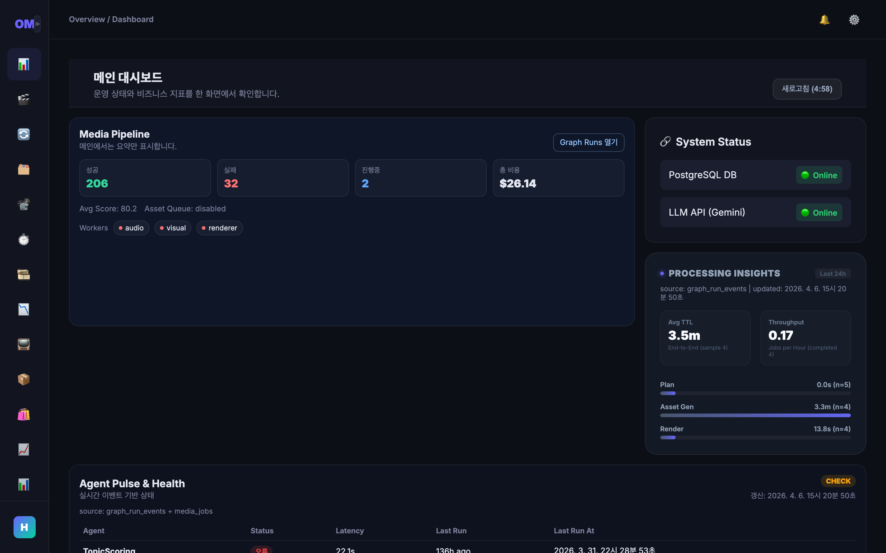
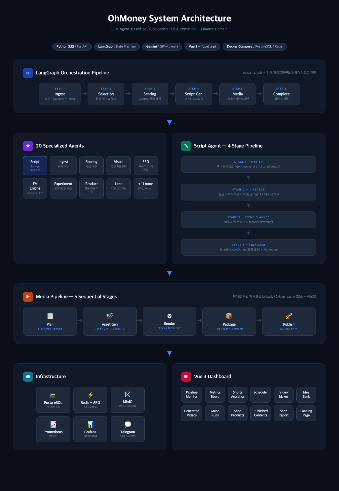

# OhMoney

LangGraph 기반 에이전트로 YouTube Shorts의 수집·기획·제작·게시·분석 흐름을 연결하는 개인 개발 프로젝트입니다.

> **공개 범위:** 이 저장소는 아키텍처, 화면, 선별된 코드 구조를 소개하는 포트폴리오입니다. 프롬프트·스코어링·일부 연동 구현과 실행에 필요한 설정은 제외되어 있으며, 이 저장소만으로 전체 서비스를 실행할 수는 없습니다.

[주요 기능](#주요-기능) · [처리 흐름](#처리-흐름) · [기술 스택](#기술-스택) · [구현 참고 문서](docs/implementation-reference.md) · [공개 범위와 제약](#공개-범위와-제약)



## 주요 기능

- **에이전트 오케스트레이션:** LangGraph 상태와 조건부 분기로 토픽 선정, 스크립트 생성, 미디어 작업을 연결합니다.
- **단계별 콘텐츠 생성:** Writer → Director → Scene Planner → Finalizer로 초안·리뷰·씬 구성·메타데이터 생성을 분리합니다.
- **모델 배정:** 토픽 등급에 따라 LLM 프로바이더를 다르게 사용합니다.
- **미디어 파이프라인:** Plan → Asset → Render → Package → Publish를 단계별로 처리하고 실패 시 재시도·대체 처리를 적용합니다.
- **운영 도구:** 작업 큐, 스케줄러, 대시보드, Telegram 알림으로 실행 상태와 실패 작업을 추적합니다.
- **분석·피드백:** 게시 후 지표를 수집하고 다음 토픽 선정과 자원 배정에 활용합니다.

## 처리 흐름

```text
수집 → 토픽 선정 → 스크립트 생성 → 미디어 작업 큐
                                     │
                                     ▼
                    Plan → Asset → Render → Package → Publish
                                     │
                                     ▼
                              분석 → 다음 주기 피드백
```

### 스크립트 생성

| 단계 | 역할 |
| --- | --- |
| Writer | 훅과 본문 초안 생성 |
| Director | 초안 리뷰와 개선 지시 |
| Scene Planner | 비주얼 씬 구성 |
| Finalizer | SEO·마케팅 메타데이터를 포함한 패키지 조합 |

### 미디어 처리

| 단계 | 입력 → 출력 |
| --- | --- |
| Plan | 스크립트 → 씬 계획 |
| Asset | 씬 프롬프트 → 영상·음성 소스 |
| Render | 씬·음성 → 세로형 MP4 |
| Package | 영상·메타데이터 → 업로드 패키지 |
| Publish | 패키지 → YouTube 게시 |

단계별 재시도는 실패한 작업을 복구하기 위한 구조입니다. 외부 API 성공이나 모든 산출물의 품질을 보장하는 의미는 아닙니다.

## 아키텍처



API는 작업을 등록하고, ARQ 워커가 LLM·미디어 처리를 수행합니다. PostgreSQL은 서비스 데이터를, Redis는 작업 큐를, MinIO는 미디어 저장소를 담당합니다. 로컬 디스크와 MinIO를 함께 사용하는 캐시로 재사용 가능한 미디어의 중복 생성을 줄입니다.

상태 계약, 에이전트 목록, 단계별 오류 처리, 배포 구성 예시는 [구현 참고 문서](docs/implementation-reference.md)에 있습니다. 목록에는 에이전트와 미디어 워커가 함께 포함되므로 행 개수를 그대로 독립 LLM 에이전트 수로 해석하지 않습니다.

## 기술 스택

| 영역 | 구성 |
| --- | --- |
| 백엔드 | Python 3.12, FastAPI, SQLAlchemy 2.0, ARQ |
| 오케스트레이션 | LangGraph |
| LLM | Gemini, GPT-4o-mini, Instructor |
| 미디어 | Google Veo, Gemini TTS, FFmpeg |
| 프론트엔드 | Vue 3, TypeScript, Vite, Pinia |
| 데이터·운영 | PostgreSQL, Redis, MinIO, Docker Compose |
| 모니터링 | Prometheus, Grafana, Telegram |

모델·프로바이더 이름은 문서에 기록된 구성입니다. 현재 제공 여부·무료 할당량·요금은 각 제공자의 정책을 확인해야 합니다.

## 저장소 둘러보기

| 경로 | 내용 |
| --- | --- |
| [app/](app/) | 백엔드·에이전트·파이프라인의 공개 코드 구조 |
| [frontend/](frontend/) | 운영 화면 관련 공개 코드 |
| [monitoring/](monitoring/) | 모니터링 구성 |
| [docker-compose.yml](docker-compose.yml) | 서비스 구성 참고 |
| [docs/implementation-reference.md](docs/implementation-reference.md) | 설계 판단, 데이터 계약, 구현 예시, 전체 화면 모음 |

## 공개 범위와 제약

다음은 공개하지 않습니다.

- LLM 프롬프트 전문과 도메인별 비즈니스 로직
- EV 계산·토픽 스코어링 알고리즘
- 제휴 서비스 연동 코드와 실제 수집기 구현
- API 키와 운영 환경 설정

따라서 전체 서비스용 설치·실행 명령은 제공하지 않습니다. 화면의 지표와 모델 배정 정책은 기능·설계 설명이며, 공개 검증된 수익이나 비용 절감 성과를 뜻하지 않습니다.

## 문의

구조나 공개 예시에 관한 질문은 [GitHub Issues](https://github.com/HoonStyle/OhMoney-portfolio/issues)로 남겨 주세요. 민감한 운영 정보나 인증정보는 올리지 마세요.

Maintainer: [HoonStyle](https://github.com/HoonStyle)
