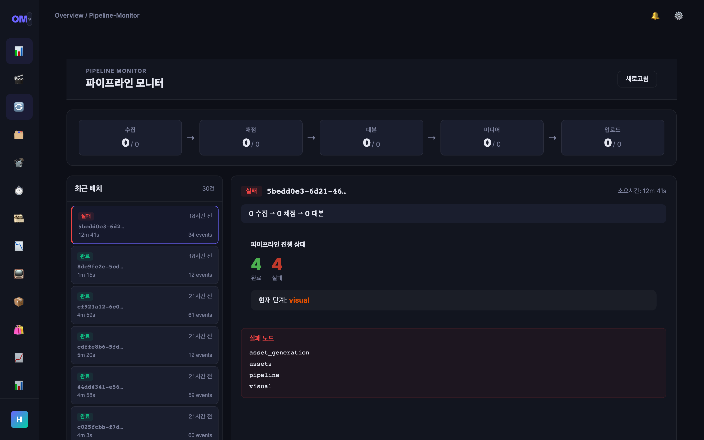
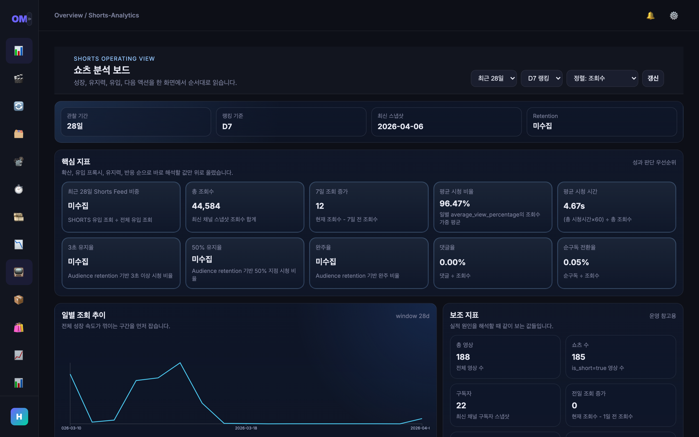
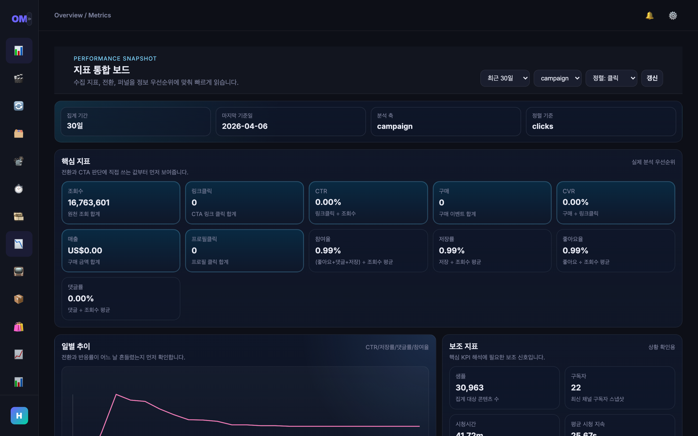
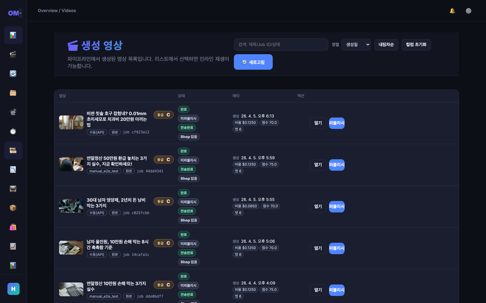
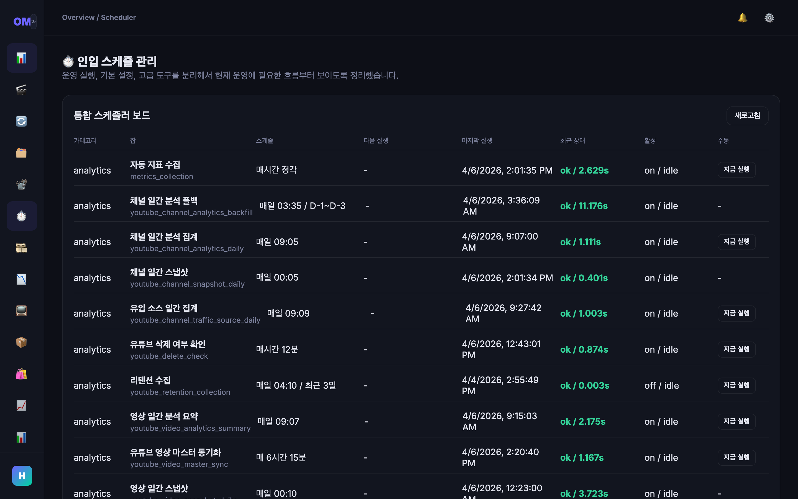
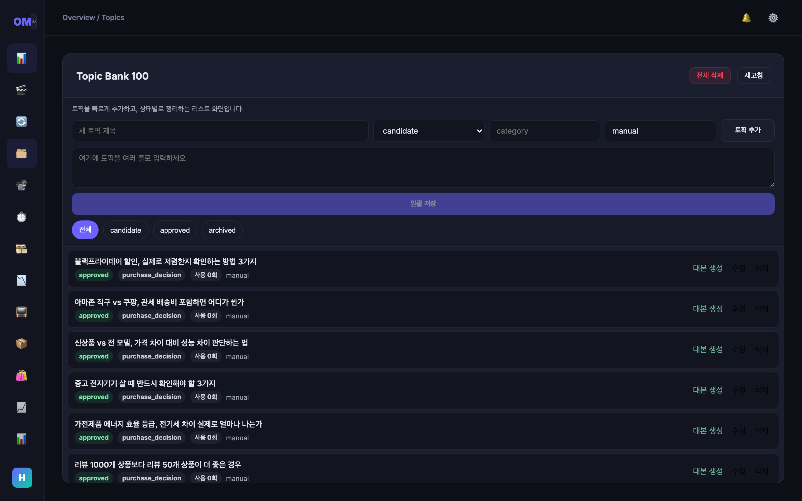
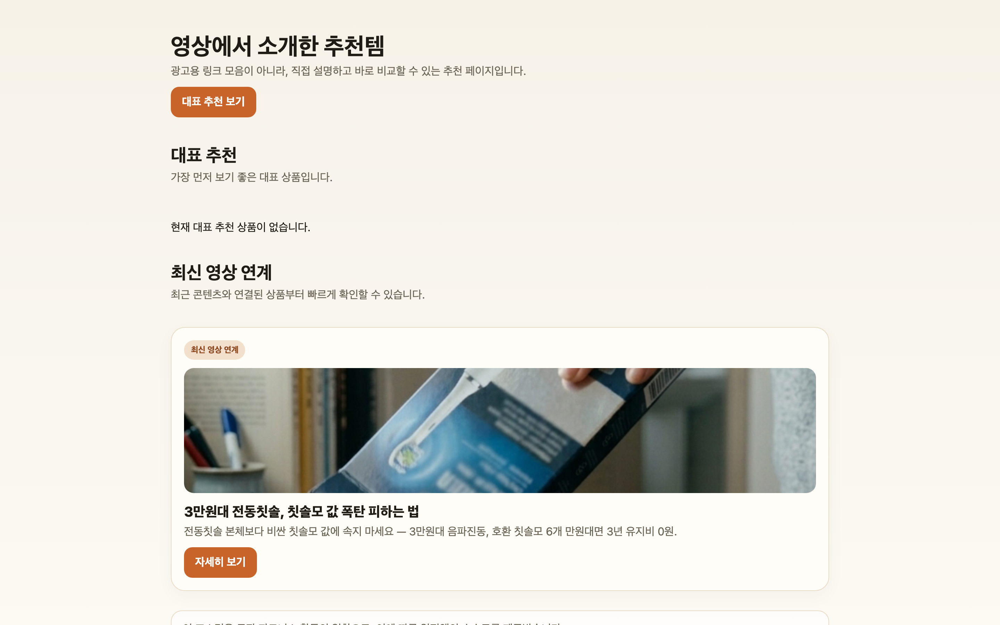

# OhMoney — LLM Agent-Based YouTube Shorts Automation System

> 금융/보험/투자 도메인 특화 YouTube Shorts 완전자동화 시스템.
> 수집 → 토픽 선정 → 스크립트 생성 → 미디어 렌더링 → 게시 → 분석 → 피드백 루프를 1인 운영으로 자동화합니다.

**Note:** 이 레포는 포트폴리오 공개용입니다. 프롬프트, 비즈니스 로직, 스코어링 알고리즘 등 핵심 지적 재산은 제외되어 있습니다.

---

## Problem & Hypothesis

### 타겟
**30대 남성 1인 가구** — 자산 형성 초기 단계, 금융·보험·투자 정보 수요는 크지만 학습 시간 부족, 텍스트 진입장벽이 높고 롱폼 영상은 시간 부담이 큼.

> 타겟을 좁게 정의해 페르소나·언어·톤·상품 매칭의 일관성을 확보. 검증 후 인접 페르소나(30대 여성, 40대 1인 가구 등)로 횡적 확장 예정.

### 가설
1. **LLM 에이전트로 도메인 특화 생산 파이프라인을 자동화하면, 1인 운영자가 다채널·다토픽으로 확장 가능하다**
2. 차별화의 핵심 IP는 "도메인 프롬프트 + 토픽 스코어링 알고리즘"에 있고, 그 외 작업(스크립트·렌더·게시·분석)은 모두 자동화 가능하다
3. 영상 → 랜딩 → 상품 퍼널을 처음부터 묶어 설계하면, 단순 광고수익이 아닌 **퍼포먼스 기반 수익 모델**로 전환할 수 있다

### 검증 지표 (단계별)
| 단계 | 지표 | 의미 |
|------|------|------|
| **운영 가능성** | 일 자동 발행 편수, 사람 개입 시간/일 | 1인 운영 임계치 도달 여부 |
| **콘텐츠 품질** | 평균 시청 지속율, 좋아요율, 구독 전환율 | 자동 생성물이 시장에서 통하는가 |
| **비즈니스** | 영상→랜딩 CTR, 상품 클릭당 비용(CPA), LTV | 퍼포먼스 모델 성립 여부 |

---

## Live Demo

이 시스템이 실제로 생성·게시한 YouTube Shorts 예시입니다.

[](https://youtube.com/shorts/LGiRAPyuo6w?feature=share)

▶ **[30대 외로움, 혼자라서가 아니었다? 진짜 이유 4가지](https://youtube.com/shorts/LGiRAPyuo6w?feature=share)**

위 영상은 토픽 선정 → 스크립트 4단계 생성 → Veo 영상 생성 → Gemini TTS → FFmpeg 렌더링 → YouTube 게시까지 파이프라인 전 과정을 거쳐 자동 생성되었습니다.

---

## Product Decisions & Trade-offs

기술 선택 이전에 내린 **제품 의사결정**들입니다. 각 결정은 명확한 포기 대상과 함께 기록합니다.

| 결정 | 선택 | 포기한 것 | 이유 |
|------|------|-----------|------|
| **타겟 페르소나** | 30대 남성 1인 가구 | 30~40대 전체 / 성별 무관 | 페르소나가 좁아야 메시지 톤·상품 매칭·썸네일 카피의 일관성 확보. 인접 페르소나로 횡적 확장이 다음 단계 |
| **콘텐츠 포맷** | Shorts (60초 이내) | 롱폼·블로그 | 진입장벽 낮고 알고리즘 노출 큼. 정보 밀도 손실은 **시리즈 구조**로 보완 |
| **생성 방식** | 자동 생성 + 샘플 검수 | 풀 수동 / 풀 자동 | 1인 운영 임계치 안에서 품질 확보. 4단계 스크립트(Writer→Director→Scene Planner→Finalizer)로 자동 품질 보증 |
| **도메인 전략** | 금융·보험·투자 **단일 도메인** 깊게 | 멀티 버티컬 동시 진입 | 도메인 노하우(프롬프트·법규·용어)가 진입장벽이자 차별화. 단일 도메인에서 검증 후 수평 확장 |
| **LLM 비용 모델** | Grade-based 라우팅 (S/A → GPT, B/C → Gemini Free) | 단일 모델 일괄 사용 | 기대수익이 높은 토픽에만 품질 투자. 평균 품질 손실 최소화하며 비용을 큰 폭으로 절감 |
| **수익 모델** | 영상→랜딩→제휴상품 퍼널 (퍼포먼스) | 광고수익(애드센스) 단독 | Shorts CPM이 낮아 단가 대비 ROI 한계. 퍼널 설계로 클릭당·전환당 수익 구조 확보 |
| **인프라** | Mac mini single-node | 클라우드(AWS/GCP) | 초기 트래픽에선 고정비 거의 0. 컨테이너 그대로 패키징되어 있어 스케일 시 클라우드 이전 비용 낮음 |
| **사람 개입 지점** | 토픽 후보 검수 + 게시 전 최종 확인 | 완전 무인 / 모든 단계 검수 | 법규·민감 정보 리스크가 큰 도메인 특성상 무인은 위험. 두 지점만 사람이 보면 리스크 ≈ 0에 가깝게 통제 가능 |

---

## Screenshots

### Dashboard Overview

시스템 상태, 파이프라인 처리량, 에이전트 헬스체크를 한눈에 확인하는 메인 대시보드.


### Pipeline Monitor

파이프라인 실행 상태를 실시간으로 모니터링. 각 단계(수집→스코어링→스크립트→미디어→게시)의 진행 상황과 에러를 추적.



### Shorts Analytics

YouTube Shorts 핵심 지표(조회수, 시청 지속율, CTR) 분석 보드. 일별 추이와 보조 지표를 함께 제공.



### Metrics Board

수익 지표, 전환율, CPA 등 캠페인 성과를 종합적으로 분석하는 지표 통합 보드.



### Generated Videos

생성된 영상 목록. 각 영상의 상태, 생성일, 조회수를 확인하고 상세 정보에 접근.



### Scheduler

자동 수집, 분석, 게시 등 반복 작업의 스케줄 관리. 실행 이력과 상태를 실시간 확인.



### Idea Bank

토픽 아이디어 관리. 카테고리별 필터링, 상태 추적(candidate → approved → archived), 수동 토픽 추가.



### Product Landing Page

영상에서 소개한 상품을 비교/확인할 수 있는 외부 공개 랜딩 페이지. 영상 → 상품 전환 퍼널의 핵심 접점.



---

## Architecture Overview


---

## Tech Stack

| Layer | Technology |
|-------|-----------|
| **Backend** | Python 3.12 / FastAPI / SQLAlchemy 2.0 / ARQ (async task queue) |
| **Orchestration** | LangGraph (state machine-based pipeline) |
| **LLM** | Gemini (default) / GPT-4o-mini (high-quality) / Instructor (structured output) |
| **Media** | Google Veo (video gen) / Gemini TTS / FFmpeg |
| **Frontend** | Vue 3 + TypeScript + Vite + Pinia |
| **Infra** | Docker Compose / PostgreSQL / Redis / MinIO / Prometheus + Grafana |
| **Deploy** | Mac mini single-node |

---

## Key Design Decisions

### 1. LangGraph State Machine for Orchestration

일반적인 DAG 기반 워크플로우 대신 LangGraph의 `StateGraph`를 선택한 이유:

- **조건부 분기**: 토픽 등급(S/A/B/C)에 따라 LLM 프로바이더를 동적 라우팅
- **상태 추적**: `PipelineMasterState`로 전체 파이프라인 상태를 단일 TypedDict로 관리
- **취소 지원**: 각 노드 진입 시 취소 요청 확인 → 즉시 중단
- **재시도 격리**: 노드 단위 재시도로 전체 파이프라인 재실행 방지

```python
class PipelineMasterState(TypedDict, total=False):
    job_id: str
    candidates: list[CandidateItem]
    scored_topics: list[dict[str, Any]]
    scripts: list[ScriptPackageOutput]
    enqueued_media_jobs: list[str]
    # ... 15+ state fields
```

### 2. 4-Stage Script Agent Pipeline

단일 LLM 호출 대신 4단계 파이프라인으로 분리:

```
Writer → Director → Scene Planner → Finalizer
```

- **Writer**: 훅 + 본문 초안 생성
- **Director**: 품질 리뷰 & 개선 지시
- **Scene Planner**: 비주얼 씬 분해
- **Finalizer**: SEO/마케팅 데이터 포함 최종 패키지 조합

각 단계는 독립적으로 fallback 가능 → 부분 실패 시 전체 재생성 불필요.

### 3. Grade-Based LLM Cost Management

토픽 등급에 따라 LLM 프로바이더를 차등 배정:

| Grade | Provider | Rationale |
|-------|----------|-----------|
| S/A | GPT-4o-mini | 높은 기대수익 → 품질 투자 정당화 |
| B/C | Gemini Free Tier | 낮은 기대수익 → 비용 최소화 |

### 4. 2-Layer Media Cache

API 호출 비용과 속도를 최적화하기 위한 이중 캐시:

```
Request → L1 (Local Disk) → L2 (MinIO) → API Call
              ↑ write-back       ↑ write-through
```

- 동일 씬 재생성 시 API 호출 0회
- MinIO에 영구 보관 → 로컬 캐시 유실 시에도 복구 가능

### 5. Async-First with ARQ

모든 I/O를 비동기로 처리하되, 파이프라인 실행은 ARQ(Redis 기반 task queue)로 분리:

- API 서버는 작업 등록만 담당 → 즉시 응답
- 무거운 LLM/미디어 작업은 별도 워커에서 실행
- Single-flight lock으로 동일 작업 중복 실행 방지

---

## Agent Architecture

20개의 특화 에이전트가 각각 단일 책임을 가지며, `master_graph`를 통해 조율됩니다.

```python
# Base Agent Pattern
class BaseAgent(ABC, Generic[TIn, TOut]):
    """모든 에이전트의 추상 베이스 클래스"""

    @abstractmethod
    async def run_async(self, payload: TIn) -> TOut:
        ...

    async def run_via_langgraph_async(self, payload: TIn) -> TOut:
        """LangGraph StateGraph를 통한 실행 (추적/모니터링 통합)"""
        graph = self._get_invoke_graph()
        final_state = await graph.ainvoke({"payload": payload})
        return final_state["result"]
```

### Agent List

| Category | Agents |
|----------|--------|
| **Content Pipeline** | IngestAgent, TopicScoringAgent, ScriptAgent, VisualAgent, SeoAgent |
| **Media Pipeline** | PlanWorker, AssetWorker, RenderWorker, PackagerWorker, PublisherWorker |
| **Analytics** | MetricsCollectorAgent, EVEngineAgent, ExperimentJudgeAgent, WeeklyReportAgent |
| **Monetization** | ProductAgent, OfferRouterAgent, FunnelRouterAgent, LeadScoringAgent |
| **Operations** | ContentSyncAgent, LinkCheckAgent, FaqReplyAgent, NextTopicAgent |

---

## Media Pipeline

5단계 순차 처리 파이프라인. 각 단계는 독립적으로 재시도 가능합니다.

```
Plan → Asset → Render → Package → Publish
```

| Stage | Input | Output | Technology |
|-------|-------|--------|-----------|
| Plan | ScriptPackageOutput | Scene breakdown | LLM-based planning |
| Asset | Scene prompts | Video/Audio files | Google Veo + Gemini TTS |
| Render | Scenes + Audio | Final MP4 (1080×1920) | FFmpeg |
| Package | Video + Metadata | Upload-ready package | Title/Tags/Comments |
| Publish | Package | Published video | YouTube Data API v3 |

### Error Handling Strategy

| Stage | On Failure |
|-------|-----------|
| Plan | Abort pipeline, Telegram alert |
| Asset | 3 retries (exponential backoff) → static image fallback |
| Render | Skip failed scene, merge remaining |
| Package | Use default title/tags |
| Publish | Re-enqueue for next cycle |

---

## Data Flow

```python
# Core data contracts (Pydantic models)

class ScriptPackageOutput(BaseModel):
    """Script Agent → Media Pipeline 핸드오프 스키마"""
    idea_id: int
    hook: str
    body: list[str]
    cta: str
    template_type: str          # A/B/C/D
    visuals: list[VisualPrompt]
    video_scene_prompts: list[VideoScenePrompt]
    seo_data: SeoPackage
    marketing_data: MarketingData

class ScriptReadyPayload(BaseModel):
    """Media Pipeline 입력 스키마"""
    narration_text: str
    scenes: list[Scene]
    tone_profile: ToneProfile
```

---

## Infrastructure

```yaml
# Docker Compose Services
services:
  api_app:        # FastAPI backend (port 9100)
  scheduler:      # APScheduler daemon
  postgres:       # PostgreSQL database
  redis:          # ARQ queue backend
  minio:          # S3-compatible object storage
  prometheus:     # Metrics collection
  grafana:        # Metrics dashboard
```

```dockerfile
# Dockerfile highlights
FROM python:3.12-slim
RUN apt-get install -y ffmpeg fonts-noto-cjk fonts-nanum  # CJK font support
# Alembic migrations on startup
CMD ["uvicorn", "app.main:app", "--host", "0.0.0.0", "--port", "8000"]
```

---

## Project Structure

```
.
├── app/
│   ├── main.py                    # FastAPI application
│   ├── config.py                  # Environment-based settings
│   ├── db.py                      # SQLAlchemy session
│   ├── db_models.py               # ORM models (20+ tables)
│   ├── agents/
│   │   ├── base.py                # BaseAgent[TIn, TOut] ABC
│   │   ├── script_agent.py        # 4-stage script pipeline
│   │   ├── ingest_agent.py        # Topic ingestion
│   │   ├── topic_scoring_agent.py # Grade assignment (S/A/B/C)
│   │   ├── visual_agent.py        # Visual prompt generation
│   │   ├── seo_agent.py           # SEO optimization
│   │   └── ...                    # 15+ more agents
│   ├── orchestration/
│   │   ├── master_graph.py        # LangGraph state machine
│   │   ├── arq_tasks.py           # Background job orchestration
│   │   └── guards.py              # Auth & validation
│   ├── media_pipeline/
│   │   ├── pipeline.py            # 5-stage media orchestration
│   │   ├── models.py              # Pipeline data models
│   │   ├── workers/               # Plan/Asset/Render/Package/Publish
│   │   └── services/              # Cache, state, metrics, DLQ
│   ├── routers/                   # REST API endpoints
│   ├── schemas/                   # Pydantic I/O contracts
│   ├── services/                  # Business logic layer
│   └── collectors/                # Data source integrations
├── frontend/
│   ├── src/
│   │   ├── views/                 # 12 page components
│   │   ├── components/            # Reusable UI components
│   │   ├── composables/           # Vue 3 composition hooks
│   │   └── router/                # Client-side routing
│   └── vite.config.ts
├── alembic/                       # Database migrations
├── monitoring/                    # Prometheus + Grafana config
├── docker-compose.yml             # 7 services
├── Dockerfile
└── requirements.txt
```

---

## Metrics & Monitoring

- **Prometheus**: 파이프라인 단계별 소요시간, LLM 호출 횟수, 에러율
- **Grafana**: 실시간 대시보드 (API latency, pipeline throughput)
- **Telegram**: 작업 완료/실패 알림, 운영 명령 인터페이스
- **Custom Metrics**: 토픽별 EV 추적, A/B 실험 결과

---

## What's Not Included

이 레포는 포트폴리오 공개용으로 다음 항목은 의도적으로 제외했습니다:

- LLM 프롬프트 전문 (도메인 노하우)
- EV 계산 및 토픽 스코어링 알고리즘
- 제휴 연동 코드 (쿠팡 파트너스 등)
- API 키 및 환경 설정
- 실제 수집기 구현 (뉴스/YouTube/Reddit)

---

## Contact

- GitHub: [@HoonStyle](https://github.com/HoonStyle)
